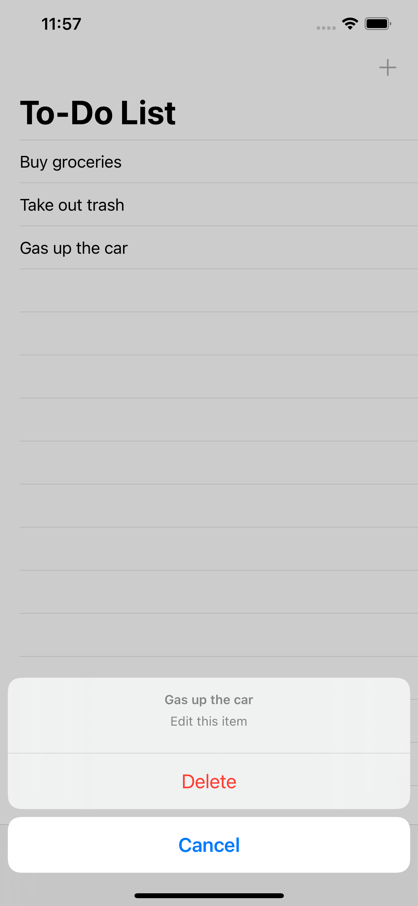

# todoListApp #
## My first iOS app written in Swift, built with UIKit storyboard. ##
### What I Learned: ###
* How to use storyboard in Xcode.
* Implemented a textfield, datepicker and tableviews with/without sections. 
* How to create custom cells in a tableview with .xib files.
* Action Sheets and Modal presentations.
* Navigation/Tab Bar controllers.
* Implementing persistent data in the app.
* Transferring data between different view controllers.

### Screenshots ###
  
